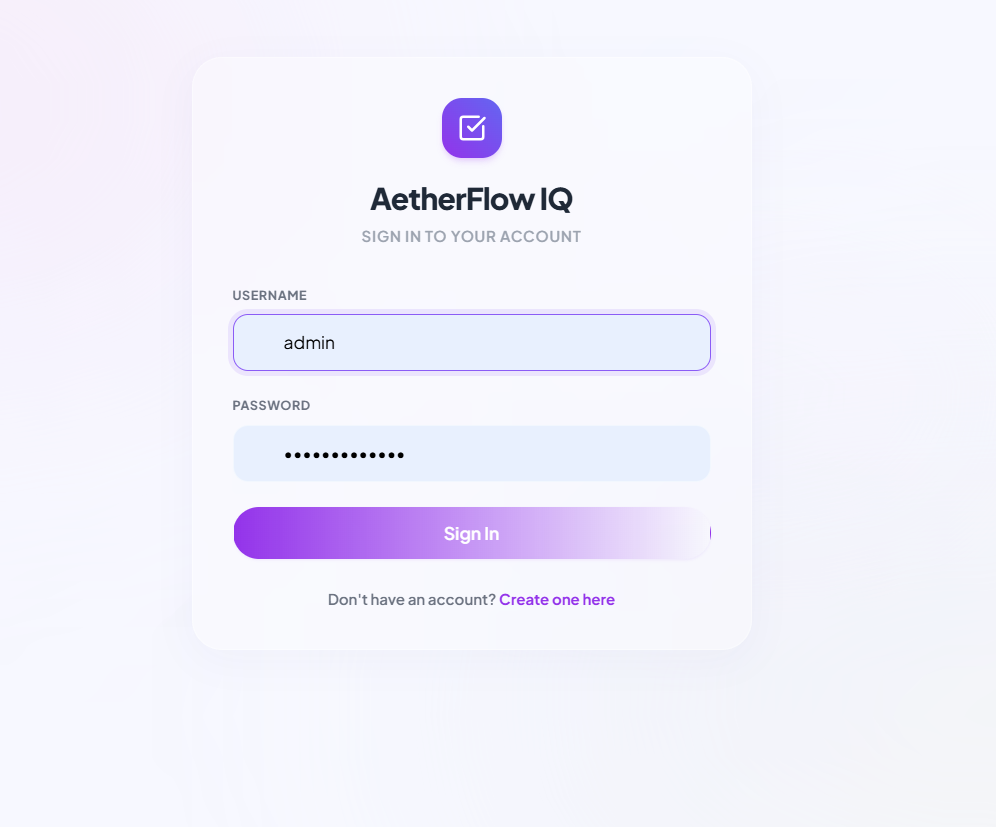
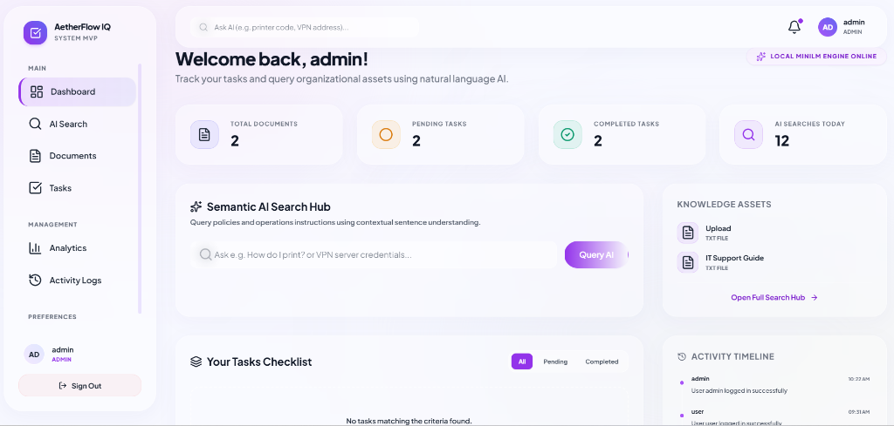
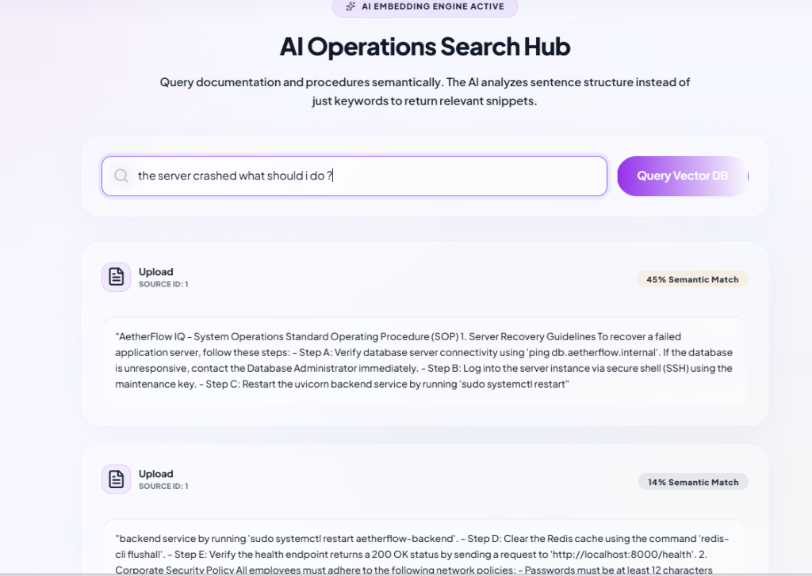
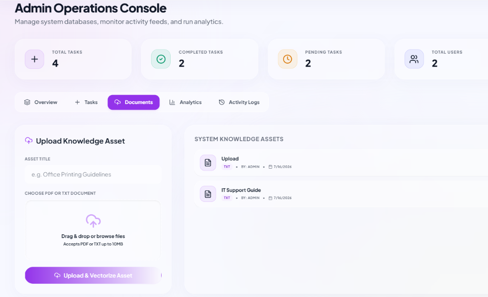
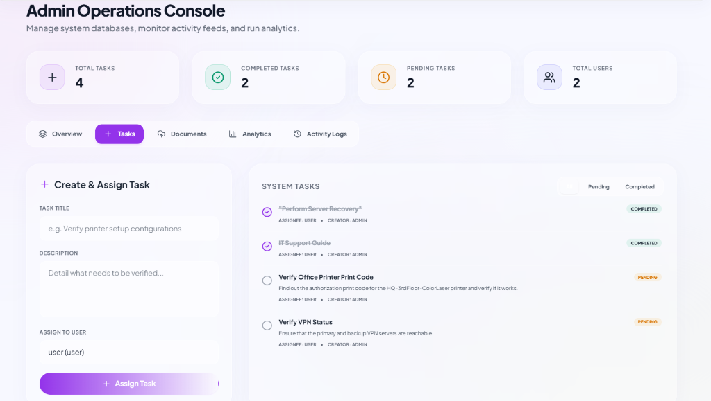
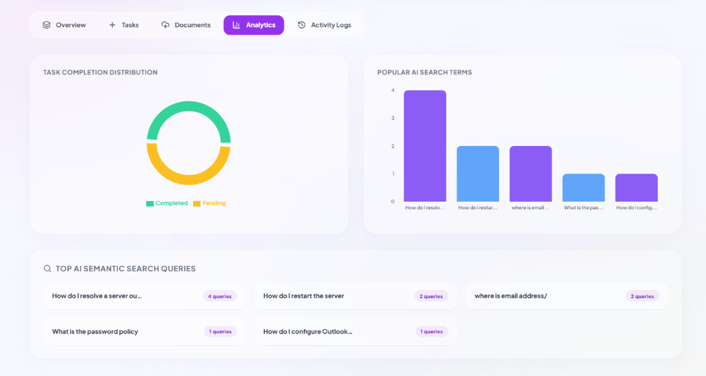
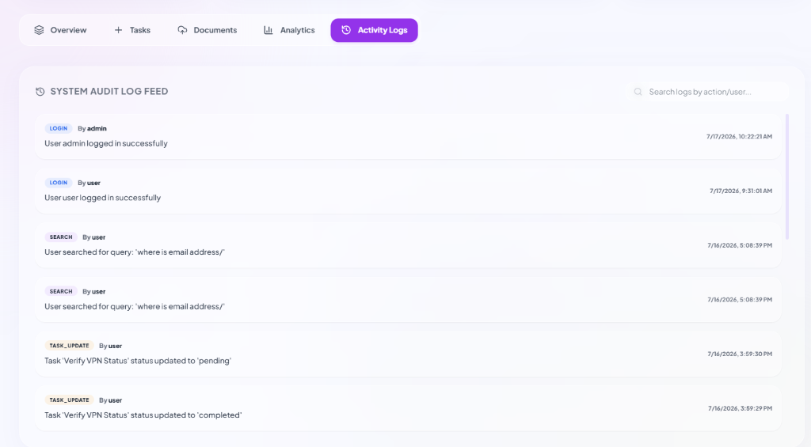
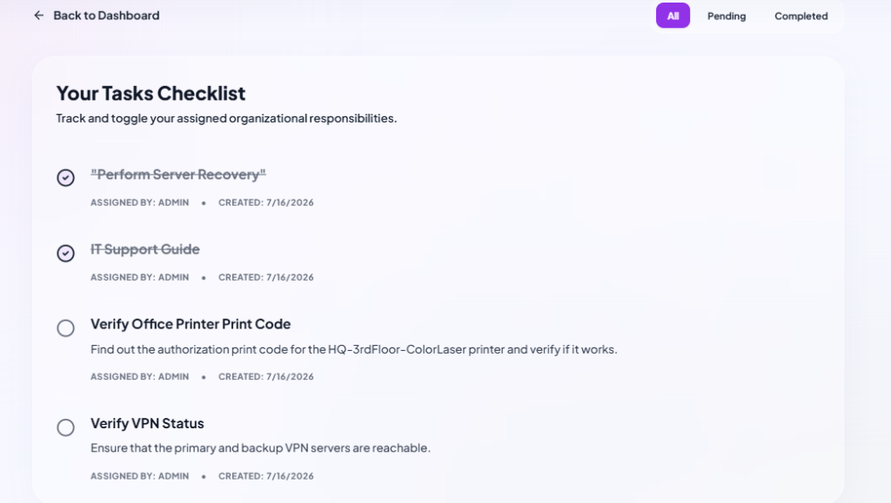

# AetherFlow IQ: AI-Powered Task & Knowledge Management System

AetherFlow IQ is a high-performance, production-grade Minimum Viable Product (MVP) that integrates User Identity Management, Role-Based Access Control (RBAC), and Task Workflows with local AI-powered Semantic Search.

Developed using **FastAPI**, **React.js**, **MySQL**, and **FAISS (Facebook AI Similarity Search)** with a custom **NumPy-powered Local Vector Store fallback**, this system allows administrators to assign tasks and build a knowledge base, which users can search using local vector embeddings (no external API keys needed) to get answers and complete assignments.

---

> [!TIP]
> **🔗 Live Application Sandbox**  
> For immediate evaluation and demonstration purposes, a live deployment of this system is running and accessible directly at:  
> **[https://alphabet-pajamas-dried.ngrok-free.dev](https://alphabet-pajamas-dried.ngrok-free.dev)**  
> *(Note: Since the server is tunneled using ngrok, please click **"Visit Site"** if prompted by the ngrok warning page.)*

---

## 🛠️ System Architecture & AI Pipeline

```
[Document Upload (PDF/TXT)] ──> [Text Extraction (pypdf)] ──> [Recursive Boundary Chunking]
                                                                        │
[FAISS Cosine Search Matches] <── [FAISS Index / NumPy Store] <── [Local MiniLM Embeddings (384d)]
```

### 1. The Semantic Search Core
*   **Embedding Model**: `sentence-transformers/all-MiniLM-L6-v2`. This model processes natural language queries locally into 384-dimensional dense vectors on CPU, achieving low latency and zero external API dependencies.
*   **Vector Database (FAISS)**: The application utilizes **FAISS (`faiss-cpu`)** using an Inner Product Index (`IndexFlatIP`). By L2-normalizing embeddings upon insertion and query (using `faiss.normalize_L2`), the inner product search results are mathematically identical to Cosine Similarity.
*   **Resilient Fallback**: To ensure compile-free portability across all operating systems and environments, the application includes a custom NumPy-based similarity search engine that activates automatically if the FAISS binary is unavailable.
*   **Semantic Text Chunking**: Raw files are chunked recursively at `500` characters with a `50`-character overlap. The parser looks backward for natural whitespace boundaries, preventing mid-word splitting to preserve context.

### 2. Relational Schema Normalization (MySQL)
Our database design utilizes strict primary/foreign keys and index optimizations:
*   `roles` (PK) -> Standardizes RBAC (`admin`, `user`).
*   `users` (PK, FK -> roles) -> Encrypts passwords using `bcrypt`.
*   `tasks` (PK, FK -> users) -> Stores assignment relations and workflow states.
*   `documents` (PK, FK -> users) -> Saves files on disk with index references.
*   `activity_logs` (PK, FK -> users) -> High-frequency audit trail logs.
*   `notifications` (PK, FK -> users) -> Logs task creation and knowledge updates.

---

## 🖥️ System Output Screenshots

Below are screenshots demonstrating the operational features of AetherFlow IQ:

### 1. Sign In Portal (Secure Authentication)
Secure authentication with role-based access redirection:


### 2. Main Dashboard (Welcome & Overview)
A unified workspace showing active tasks, knowledge assets, semantic search hub, and activity timeline:


### 3. AI Operations Search Hub (Local FAISS Semantic Vector Search)
Matches query concepts rather than relying on strict keywords:


### 4. Admin Operations Console (Document Uploading & Vectorization)
Upload PDF and TXT guidelines, which are parsed and indexed locally:


### 5. Admin Operations Console (Create & Assign Tasks)
Admin control panel to manage tasks, assign them to users, and monitor completion states:


### 6. System Analytics Dashboard (Task Completion & Search Query Trends)
Visual tracking of task progress and popular AI search queries:


### 7. System Audit Log Feed (High-Frequency Activity Trail)
Provides transparency into all user operations, logins, and searches:


### 8. User Tasks Checklist (Role-Based Task Tracker)
Enables standard users to toggle and complete assigned responsibilities with optimistic UI rendering:


---

## 🚀 Getting Started

### Prerequisites
*   **Python 3.10+** (Includes support for pip / virtual env)
*   **Node.js 18+** (Includes npm package runner)
*   **MySQL Server** (Running on `localhost:3306` with `root` user and password configured in your environment. To customize database credentials, modify `DATABASE_URL` in `backend/.env`).

---

### ⚡ Option A: Quick Bootstrap (Recommended)
An automated bootstrapping script is provided that creates the MySQL database, seeds default users, and boots up both backend and frontend servers in separate processes.

1. Open **PowerShell** as an administrator.
2. Navigate to the project root directory.
3. Run the bootstrapper:
   ```powershell
   Set-ExecutionPolicy -Scope Process -ExecutionPolicy Bypass
   .\run.ps1
   ```

---

### 🛠️ Option B: Manual Setup

#### 1. Setup Backend
1. Navigate to the backend folder:
   ```bash
   cd backend
   ```
2. Create and activate a Python virtual environment:
   ```bash
   python -m venv .venv
   # Windows:
   .\.venv\Scripts\activate
   # macOS/Linux:
   source .venv/bin/activate
   ```
3. Install dependencies:
   ```bash
   pip install -r requirements.txt
   ```
4. Verify/Create the MySQL Database and seed default values:
   ```bash
   python setup_db.py
   ```
5. Run the FastAPI development server:
   ```bash
   python -m uvicorn app.main:app --host 127.0.0.1 --port 8000 --reload
   ```

#### 2. Setup Frontend
1. Navigate to the frontend folder:
   ```bash
   cd ../frontend
   ```
2. Install Node modules:
   ```bash
   npm install
   ```
3. Boot the Vite local dev server:
   ```bash
   npm run dev
   ```

---

## 🔑 Default Credentials for Testing
During database initialization, two users are seeded automatically:

| Username | Password | Role | Description |
|---|---|---|---|
| `admin` | `adminpassword` | `admin` | Full control: create tasks, upload documents, inspect audit logs, and view queries. |
| `user` | `userpassword` | `user` | Standard User: view/complete assigned tasks, execute AI search. |

*Note: You can also use the **Role Selection** dropdown on the `/register` page to instantly create new administrators or users for testing.*

---

## 📊 Core API Endpoints

*   **Authentication**:
    *   `POST /auth/register` - Create standard or admin accounts.
    *   `POST /auth/login` - Handshakes with Swagger or React clients using JWT.
    *   `GET /auth/me` - Profile session checker.
    *   `GET /auth/users` - Fetches registered accounts (for task assignment).
*   **Task Management**:
    *   `GET /tasks` - Lists tasks. Supports filtering by `status` (pending/completed) and `assigned_to` (user ID).
    *   `POST /tasks` - Assigns tasks (Admin only).
    *   `PATCH /tasks/{id}/status` - Completes assigned tasks.
*   **Knowledge Base & AI Search**:
    *   `POST /documents` - Drag-and-drop file upload. Extract & embed text into the Vector Store (Admin only).
    *   `GET /documents` - Returns uploaded files metadata.
    *   `POST /search` - Semantic cosine similarity search query endpoint.
*   **Analytics & Audits**:
    *   `GET /analytics` - Renders system metrics, top search terms, and live activity logs.

---

## 📈 Future Scalability & Feature Enhancements Roadmap

If expanding this system for a high-volume corporate environment or enterprise production release, we plan to implement:

1. **Conversational RAG (Retrieval-Augmented Generation)**:
   * *Concept*: Integrate a local lightweight LLM (e.g., Llama-3 or Mistral running via **Ollama**) to synthesize direct conversational answers from vector matched snippets, moving from search-only to full question-answering.
2. **Hybrid Search Indexing (Lexical + Semantic)**:
   * *Concept*: Combine semantic FAISS search with a lexical keyword matching index (like BM25 or MySQL Full-Text Search) using **Reciprocal Rank Fusion (RRF)** to maintain accuracy for exact keywords, system numbers, or error codes.
3. **Asynchronous Text Extraction & Vectorization (Celery + Redis)**:
   * *Concept*: Moving text extraction (`pypdf`) and SentenceTransformer vector indexing into background tasks using **Celery** and **Redis** to prevent blocking the HTTP main thread during large document uploads.
4. **Database Migrations (Alembic) & Containerization (Docker)**:
   * *Concept*: Standardize MySQL schemas using **Alembic** migrations instead of raw DDL calls. Bundle backend/frontend/MySQL into a `docker-compose.yml` configuration for uniform containerized deployments.
5. **Robust Test Suite (Unit & End-to-End)**:
   * *Concept*: Build test suites using **pytest** (backend routes, mocks for FAISS indexes) and **Cypress/Playwright** (frontend user authentication paths) to verify long-term stability and code coverage.

